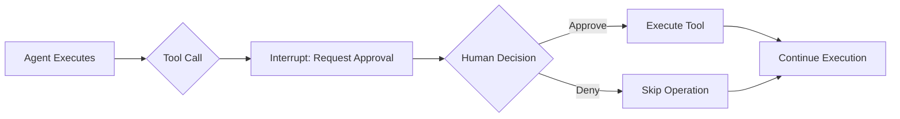
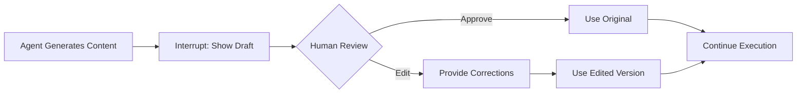
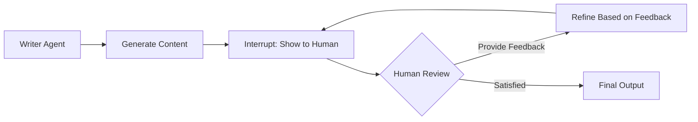
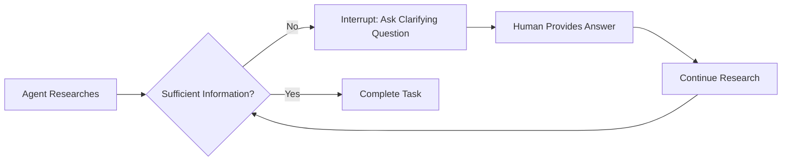

# Eino V0.6.0 Alpha Release: Human-in-the-Loop

## Introduction

We're releasing the Alpha version of Eino V0.6.0 with Human-in-the-Loop capabilities—a new feature that enables AI agents to collaborate with humans in real-time.

The framework lets you pause agent execution at almost any point, get human input, and continue with full state preservation. This means no lost context and no need to restart from scratch.

Our approach: "Interrupt anywhere, resume directly" - simple, flexible, and designed for real-world use.

## The Problem We're Solving

Eino already has interrupt/checkpoint capabilities, but building effective human-in-the-loop interactions has been harder than it should be. Here's what developers currently face:

### The Technical Overhead

- **Information Access**: Users have to dig through complex nested structures just to see what an agent wants to do
- **State Management**: You're stuck with global state mechanisms that don't work well for custom interactions
- **Resume Complexity**: Passing data back to specific interrupt points requires custom Options and boilerplate code
- **Multiple Interrupts**: When several things pause at once, it's hard to target the right one with the right data
- **Error Prone**: You have to manually ensure components resume correctly without duplicating work

### The Conceptual Gap

The current system is too technical. Instead of thinking "I want human approval here," developers have to:
- Figure out how to map human interactions to low-level interrupt mechanisms
- Rebuild common patterns like approval or review from scratch every time
- Handle communication between the technical system and human users

**The result**: Too much time spent on interrupt plumbing, not enough on actual collaboration features.

Our solution: Make human-in-the-loop interactions straightforward, with ready-to-use patterns and simple building blocks for custom needs.

## Core Patterns: Four Practical Ways to Add Human Input

**Important Note**: These four patterns are implemented as examples in our alpha release, but they're not yet finalized into the core framework. We're being conservative - we want to make sure they're the right approach before introducing them into eino-ext or eino itself. Your feedback during alpha testing will directly influence their final form.

### 1. Approval Pattern: Simple Yes/No Decisions

**When to use**: For operations that need human confirmation - like payments, database changes, or sending emails.



**Example**: A ticket booking agent preparing to book a flight pauses and asks: "Book ticket to Paris for John Smith? [Y/N]"

**Implementation**: [approval/main.go](https://github.com/cloudwego/eino-examples/blob/feat/hitl/adk/human-in-the-loop/1_approval/main.go)

### 2. Review & Edit Pattern: Fix Before Continuing

**When to use**: When an agent might get details wrong and you want to correct them before proceeding.



**Example**: A ticket booking agent shows booking details "Destination: Paris, Passenger: John Smith" and the user corrects it to "Destination: London, Passenger: Jane Doe" before confirming.

**Implementation**: [review-and-edit/main.go](https://github.com/cloudwego/eino-examples/blob/feat/hitl/adk/human-in-the-loop/2_review-and-edit/main.go)

### 3. Feedback Loop Pattern: Keep Improving Until It's Right

**When to use**: For content creation or tasks that benefit from multiple rounds of human feedback.



**Example**: A poetry-writing agent generates a verse, receives feedback "make it more humorous," and continues refining until the human indicates they're satisfied.

**Implementation**: [feedback-loop/main.go](https://github.com/cloudwego/eino-examples/blob/feat/hitl/adk/human-in-the-loop/3_feedback-loop/main.go)

### 4. Follow-up Pattern: Ask Questions When Unsure

**When to use**: When an agent needs more information to complete a task and should ask for clarification.



**Example**: A trip planning agent needs to understand user preferences and asks: "What type of activities do you enjoy: adventure sports, cultural experiences, or relaxing vacations?" The agent continues this questioning cycle until it has sufficient information to create the perfect personalized itinerary.

**Implementation**: [follow-up/main.go](https://github.com/cloudwego/eino-examples/blob/feat/hitl/adk/human-in-the-loop/4_follow-up/main.go)

## Beyond the Basics: Build Your Own Patterns

The four core patterns cover common needs, but the real value is that you're not limited to them. The underlying system lets you create any interaction pattern you need.

### Interrupt Anywhere: Three Key Implications

1. **Universal Interrupt Points**: Interrupts can happen from almost any entity - nodes, tools, graphs, sub-processes within lambdas, or agents. No component is off-limits.

2. **Arbitrary Nesting Support**: The interrupting entity can be nested anywhere in the hierarchy - from simple agents to complex workflow agents, agent tools, graphs, sub-graphs, or graphs within lambda nodes.

3. **Simple Interrupt API**: Interrupting is straightforward. Just call `StatefulInterrupt`, passing the 'info' you want end-users to see and the 'state' you want preserved for resumption.

```go
// Simple interrupt anywhere in your code
func processComplexData(ctx context.Context, data Data) error {
    if needsHumanReview(data) {
        // Interrupt with user-facing info and internal state
        return StatefulInterrupt(ctx, 
            "Complex data pattern detected - needs expert review",
            &ProcessingState{Data: data, Stage: "review"})
    }
    return processAutomatically(data)
}
```

### Resume Directly: Three Key Implications

1. **Targeted Resume Data**: No longer need to define Options or use 'StateModifier'. Just call `TargetedResume` with a map where the key is the interrupt ID and the value is the data for that specific interrupt.

2. **Automatic State Management**: The interrupting entity no longer needs to fetch state from global graph State. Everything is available in `ResumeInfo` - both state and resume data. The framework handles the plumbing.

3. **Concurrent Interrupt Control**: When multiple interrupts occur simultaneously, end-users have complete control over which ones to resume and can pass different resume data accordingly.

```go
// Resume with targeted data for specific interrupt
resumeData := map[string]any{
    "interrupt_123": "user provided correction",
    "interrupt_456": "user approval decision",
}
runner.TargetedResume(ctx, checkpointID, resumeData)
```

## Join the Alpha: Help Us Shape the Future

We're releasing our human-in-the-loop framework in alpha because we need your help. This is a significant feature that requires real-world testing and feedback before we can finalize the design.

### What to Expect (and What to Be Prepared For)

- **Your Feedback Matters**: This is not a finished product - your insights will directly shape the final API and implementation
- **Breaking Changes Are Inevitable**: As we gather feedback, we expect to make API changes. The more effective the alpha testing, the more likely breaking changes will occur
- **Bugs Will Happen**: While we've thoroughly tested the core functionality, this is alpha software and there will be issues

### How to Get Started

1. **Explore the Examples**:
   ```bash
   git clone -b feat/hitl https://github.com/cloudwego/eino-examples.git
   cd eino-examples/adk/human-in-the-loop
   ```
   
   Try the four core patterns in action:
   - **Approval Pattern**: Simple Y/N approval for critical operations
   - **Review & Edit**: In-place editing of tool arguments
   - **Feedback Loop**: Iterative content refinement
   - **Follow-up**: Proactive clarification requests

2. **Read the Documentation** (Optional, for advanced users):
   - [Framework Documentation](https://github.com/cloudwego/eino)

3. **Build Your Own Agents**:
   
   **Option 1: Fork and Extend** (Recommended for quick testing)
    - Fork the [eino-examples repository](https://github.com/cloudwego/eino-examples) (make sure to fork the `feat/hitl` branch)
    - Build your agents directly in the existing project structure
    - Leverage the pre-configured examples and tool wrappers
   
   **Option 2: Start from Scratch** (For advanced users building custom patterns)
    ```bash
    go get github.com/cloudwego/eino@v0.6.0-alpha1
    ```
    
    Build your own patterns using the low-level interrupt/resume mechanisms:
    ```go
    import "github.com/cloudwego/eino/adk"
    
    // Example: Simple resumable agent with state preservation
    func (my *myAgent) Resume(ctx context.Context, info *adk.ResumeInfo, opts ...adk.AgentRunOption) *adk.AsyncIterator[*adk.AgentEvent] {
        iter, generator := adk.NewAsyncIteratorPair[*adk.AgentEvent]()
        
        go func() {
            defer generator.Close()
            
            // Get the agent's state from the interrupt (guaranteed to exist since Resume is called)
            var state *myState
            var ok bool
            state, ok = info.InterruptState.(*myState)
            if !ok {
                generator.Send(&adk.AgentEvent{Err: errors.New("agent received invalid state type on resume")})
                return
            }
            
            // Check if user is specifically resuming this agent
            if info.IsResumeTarget {
                // Use state and resume data to continue work
                resumeData, _ := info.ResumeData.(myResumeData)
                finalEvent := &adk.AgentEvent{
                    Output: &adk.AgentOutput{
                        MessageOutput: &adk.MessageVariant{Message: schema.UserMessage("Work completed with data: " + resumeData.Content)},
                    },
                }
                generator.Send(finalEvent)
            } else {
                // Re-interrupt to preserve state and continue flow
                reInterruptAction := adk.StatefulInterrupt(ctx, "Re-interrupting to continue flow", state)
                generator.Send(&adk.AgentEvent{Action: reInterruptAction})
            }
        }()
        
        return iter
    }
    ```

3. **Join the Conversation**:
   - **Open issues for bugs, feature requests, and feedback**:
     - [eino/issues](https://github.com/cloudwego/eino/issues): Framework issues, API functionality, and ease of use
     - [eino-examples/issues](https://github.com/cloudwego/eino-examples/issues): Pattern/example issues, pattern adjustments, and improvements
   - **Share your stories and agents**:
     - Real-world use cases and challenges
     - Agents you've built using the framework

We're grateful for your time and expertise in helping us improve Eino. Your contributions will make the framework better for everyone.