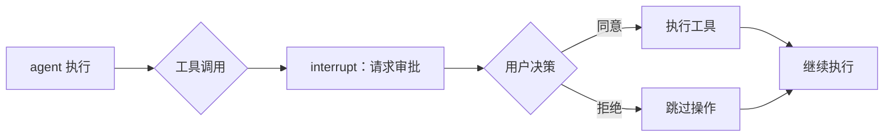
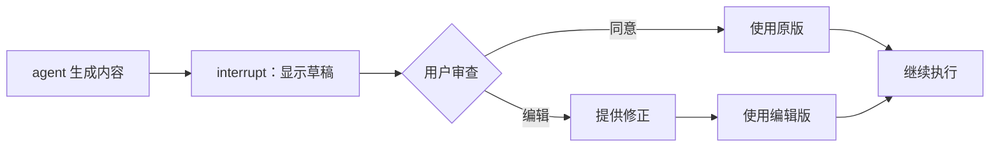
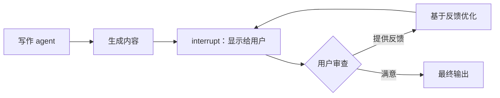
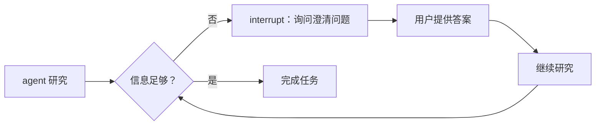

# Eino V0.6.0 Alpha 版本发布：Human-in-the-Loop

## 解决的问题

Eino 已经具备 interrupt/checkpoint 能力，但构建有效的 human-in-the-loop 交互还是有难度：

### 技术层面的挑战

- **信息获取困难**：用户需要查看复杂的嵌套结构才能了解具体 interrupt 点位的信息
- **状态管理复杂**：需要依靠图的全局 State 机制
- **恢复流程繁琐**：将数据传回特定 interrupt 点需要自定义 Options
- **多 interrupt 处理**：当多个任务同时 interrupt 时，很难针对性地传递正确数据
- **幂等**：需要手动处理幂等性问题，避免重复恢复执行

### 概念层面的差距

当前的 interrupt/checkpoint 是底层机制，并不是更场景化的 Human-in-the-Loop 功能。

- 开发者需要把底层机制映射到具体的场景化功能上
- 需要各自从头重建审批、审查等常见模式
- 需要把自己写的 interrupt ”协议“告知 end-user

## 核心模式：四种实用的用户与 agent 交互方式

### 1. 审批模式：简单的同意/拒绝决策

**适用场景**：需要用户确认的操作——如支付、数据库更改或发送邮件。



**示例**：机票预订 agent 准备预订航班时暂停并询问："为 John Smith 预订去巴黎的机票？[Y/N]"

**实现代码**：[approval/main.go](https://github.com/cloudwego/eino-examples/blob/feat/hitl/adk/human-in-the-loop/1_approval/main.go)

### 2. 审查编辑模式：修复后再继续

**适用场景**：当 agent 可能出错时，您希望在继续之前纠正细节。



**示例**：机票预订 agent 显示预订详情"目的地：巴黎，乘客：John Smith"和用户更正为"目的地：伦敦，乘客：Jane Doe"。

**实现代码**：[review-and-edit/main.go](https://github.com/cloudwego/eino-examples/blob/feat/hitl/adk/human-in-the-loop/2_review-and-edit/main.go)

### 3. 反馈循环模式：持续改进直到满意

**适用场景**：内容创作或需要多轮用户反馈的任务。



**示例**：诗歌创作 agent 生成诗句，收到反馈"让它更有趣些"，然后继续优化，直到用户表示满意。

**实现代码**：[feedback-loop/main.go](https://github.com/cloudwego/eino-examples/blob/feat/hitl/adk/human-in-the-loop/3_feedback-loop/main.go)

### 4. 追问模式：不确定时主动询问

**适用场景**：当 agent 需要更多信息来完成任务时，应该请求澄清。



**示例**：旅行规划 agent 需要了解用户偏好并询问："您喜欢什么类型的活动：冒险运动、文化体验还是休闲度假？"agent 继续这个提问循环，直到有足够信息来创建完美的个性化行程。

**实现代码**：[follow-up/main.go](https://github.com/cloudwego/eino-examples/blob/feat/hitl/adk/human-in-the-loop/4_follow-up/main.go)

## 进阶功能：构建自定义模式

在基本模式之外，Eino 支持”随处 interrupt，直接恢复“的能力，帮助开发者定制复杂的 human-in-the-loop 交互模式。

### 随处 interrupt：三个关键特性

1. **通用 interrupt 点位**：interrupt 可以发生在几乎任何实体中——节点、工具、图、lambda 中的子进程或 agent。没有组件是不可 interrupt 的。

2. **任意嵌套支持**：interrupt 实体可以嵌套在层次结构中的任何位置——从简单 agent 到复杂工作流 agent、agent 工具、图、子图或 lambda 节点中的图。

3. **简单 interrupt API**：例如调用 `StatefulInterrupt`，传递您希望最终用户看到的 `info` 和您希望保留用于恢复的 `state`。

```go
// 在代码中随处 interrupt
func processComplexData(ctx context.Context, data Data) error {
    if needsUserReview(data) {
        // interrupt 并附带用户可见信息和内部状态
        return StatefulInterrupt(ctx, 
            "检测到复杂数据模式——需要专家审查",
            &ProcessingState{Data: data, Stage: "review"})
    }
    return processAutomatically(data)
}
```

### 直接恢复：三个关键特性

1. **针对性恢复数据**：不再需要定义 Options 或使用 `StateModifier`。只需调用 `TargetedResume`，传入 map，其中 key 是 Agent Event 中返回的 interrupt ID，value 是希望具体的 interrupt 点位拿到的恢复用数据。

2. **自动状态管理**：interrupt 点位不再需要从全局图 State 获取状态。所有内容都在 `ResumeInfo` 中可用——包括状态和恢复数据。框架处理其他细节。

3. **并发 interrupt 控制**：当多个 interrupt 同时发生时，最终用户可以完全控制要恢复哪些中断，并可以相应地传递不同的恢复数据。

```go
// 使用针对性数据恢复特定中断
resumeData := map[string]any{
    "interrupt_123": "用户提供的修正",
    "interrupt_456": "用户审批决策",
}
runner.TargetedResume(ctx, checkpointID, resumeData)
```

### 用底层 interrupt/resume 机制搞自己的模式：

```go
import "github.com/cloudwego/eino/adk"

// 示例：带状态保存的简单可恢复 agent
    func (my *myAgent) Resume(ctx context.Context, info *adk.ResumeInfo, opts ...adk.AgentRunOption) *adk.AsyncIterator[*adk.AgentEvent] {
        iter, generator := adk.NewAsyncIteratorPair[*adk.AgentEvent]()
        
        go func() {
            defer generator.Close()
            
            // 从 interrupt 获取 agent 的状态（由于 Resume 被调用，状态保证存在）
            var state *myState
            var ok bool
            state, ok = info.InterruptState.(*myState)
            if !ok {
                generator.Send(&adk.AgentEvent{Err: errors.New("agent 在恢复时收到无效状态类型")})
                return
            }
            
            // 检查用户是否专门恢复这个 agent
            if info.IsResumeTarget {
                // 使用状态和恢复数据继续工作
                resumeData, _ := info.ResumeData.(myResumeData)
                finalEvent := &adk.AgentEvent{
                    Output: &adk.AgentOutput{
                        MessageOutput: &adk.MessageVariant{Message: schema.UserMessage("工作完成，数据：" + resumeData.Content)},
                    },
                }
                generator.Send(finalEvent)
            } else {
                // 重新 interrupt 以保存状态并继续流程
                reInterruptAction := adk.StatefulInterrupt(ctx, "重新 interrupt 以继续流程", state)
                generator.Send(&adk.AgentEvent{Action: reInterruptAction})
            }
        }()
        
        return iter
    }
```

## 加入 Alpha 测试：帮助我们改进

### 写在前面

- **您的反馈很重要**：会驱动我们改进设计。
- **可能会有大改动**：随着收集反馈，API 可能会变。测试越有效，改动的可能性就越大
- **肯定会有 Bug**：虽然我们测了很多遍，但毕竟是 Alpha 版本，问题肯定少不了

### 快速开始

1. **先试试示例**：
   ```bash
   git clone -b feat/hitl https://github.com/cloudwego/eino-examples.git
   cd eino-examples/adk/human-in-the-loop
   ```

2. **看看技术文档**（可选）
   - [框架文档](https://github.com/cloudwego/eino)

3. **自己动手**：
   
   **选项 1：fork 然后改**（适合快速实验）
   - fork [eino-examples 仓库](https://github.com/cloudwego/eino-examples)（记得 fork `feat/hitl` 分支）
   
   **选项 2：从头开始**（适合想搞自定义模式的老手）
    ```bash
    go get github.com/cloudwego/eino@v0.6.0-alpha1
    ```

4. **反馈与分享**：
   - **提问题和需求**：
     - [eino/issues](https://github.com/cloudwego/eino/issues)：框架问题、API 好不好用
     - [eino-examples/issues](https://github.com/cloudwego/eino-examples/issues)：模式/示例问题、怎么改进
   - **分享**：实际使用场景和有趣的 agent

衷心感谢每个使用此 alpha 版本的用户，您的每一个反馈都会让 Eino 变得更好用。