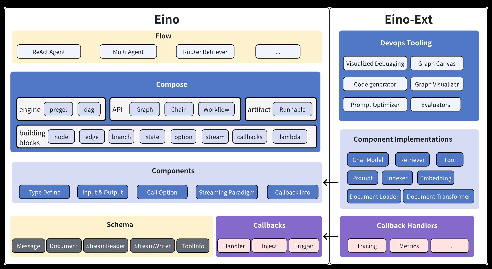

# Eino


[](https://github.com/cloudwego/eino/releases)
[](https://www.cloudwego.io/)
[](https://github.com/cloudwego/eino/blob/main/LICENSE)
[](https://goreportcard.com/report/github.com/cloudwego/eino)
[](https://github.com/cloudwego/kitex/eino)
[](https://github.com/cloudwego/eino/issues?q=is%3Aissue+is%3Aclosed)


English | [中文](README.zh_CN.md)

# Overview

**Eino['aino]** is an LLM application development framework in Golang. It draws from LangChain, Google ADK, and other open-source frameworks, and is designed to follow Golang conventions.

Eino provides:
- **Components**: reusable building blocks like `ChatModel`, `Tool`, `Retriever`, and `ChatTemplate`.
- **Agent Development Kit (ADK)**: build AI agents with tool use, multi-agent coordination, context management, interrupt/resume for human-in-the-loop, and ready-to-use agent patterns.
- **Composition**: connect components into graphs and workflows that can run standalone or be exposed as tools for agents.


# Quick Start

## ChatModelAgent

Configure a ChatModel, optionally add tools, and you have a working agent:

```Go
chatModel, _ := openai.NewChatModel(ctx, &openai.ChatModelConfig{
    Model:  "gpt-4o",
    APIKey: os.Getenv("OPENAI_API_KEY"),
})

agent, _ := adk.NewChatModelAgent(ctx, &adk.ChatModelAgentConfig{
    Model: chatModel,
})

runner := adk.NewRunner(ctx, adk.RunnerConfig{Agent: agent})
iter := runner.Query(ctx, "Hello, who are you?")
for {
    event, ok := iter.Next()
    if !ok {
        break
    }
    fmt.Println(event.Message.Content)
}
```

Add tools to give the agent capabilities:

```Go
agent, _ := adk.NewChatModelAgent(ctx, &adk.ChatModelAgentConfig{
    Model: chatModel,
    ToolsConfig: adk.ToolsConfig{
        ToolsNodeConfig: compose.ToolsNodeConfig{
            Tools: []tool.BaseTool{weatherTool, calculatorTool},
        },
    },
})
```

The agent handles the ReAct loop internally — it decides when to call tools and when to respond.

→ [ChatModelAgent examples](https://github.com/cloudwego/eino-examples/tree/main/adk/intro) · [docs](https://www.cloudwego.io/docs/eino/core_modules/eino_adk/agent_implementation/chat_model/)

## DeepAgent

For complex tasks, use DeepAgent. It breaks down problems into steps, delegates to sub-agents, and tracks progress:

```Go
deepAgent, _ := deep.New(ctx, &deep.Config{
    ChatModel: chatModel,
    SubAgents: []adk.Agent{researchAgent, codeAgent},
    ToolsConfig: adk.ToolsConfig{
        ToolsNodeConfig: compose.ToolsNodeConfig{
            Tools: []tool.BaseTool{shellTool, pythonTool, webSearchTool},
        },
    },
})

runner := adk.NewRunner(ctx, adk.RunnerConfig{Agent: deepAgent})
iter := runner.Query(ctx, "Analyze the sales data in report.csv and generate a summary chart")
```

DeepAgent can be configured to coordinate multiple specialized agents, run shell commands, execute Python code, and search the web.

→ [DeepAgent example](https://github.com/cloudwego/eino-examples/tree/main/adk/multiagent/deep) · [docs](https://www.cloudwego.io/docs/eino/core_modules/eino_adk/agent_implementation/deepagents/)

## Composition

When you need precise control over execution flow, use `compose` to build graphs and workflows:

```Go
graph := compose.NewGraph[*Input, *Output]()
graph.AddLambdaNode("validate", validateFn)
graph.AddChatModelNode("generate", chatModel)
graph.AddLambdaNode("format", formatFn)

graph.AddEdge(compose.START, "validate")
graph.AddEdge("validate", "generate")
graph.AddEdge("generate", "format")
graph.AddEdge("format", compose.END)

runnable, _ := graph.Compile(ctx)
result, _ := runnable.Invoke(ctx, input)
```

Compositions can be exposed as tools for agents, bridging deterministic workflows with autonomous behavior:

```Go
tool, _ := graphtool.NewInvokableGraphTool(graph, "data_pipeline", "Process and validate data")

agent, _ := adk.NewChatModelAgent(ctx, &adk.ChatModelAgentConfig{
    Model: chatModel,
    ToolsConfig: adk.ToolsConfig{
        ToolsNodeConfig: compose.ToolsNodeConfig{
            Tools: []tool.BaseTool{tool},
        },
    },
})
```

This lets you build domain-specific pipelines with exact control, then let agents decide when to use them.

→ [GraphTool examples](https://github.com/cloudwego/eino-examples/tree/main/adk/common/tool/graphtool) · [compose docs](https://www.cloudwego.io/docs/eino/core_modules/chain_and_graph_orchestration/)

# Key Features

## Components

- **Component abstractions** with multiple **implementations** ready to use
    - Abstractions include ChatModel, Tool, ChatTemplate, Retriever, Document Loader, Lambda, etc.
    - Each component type has its own interface: defined Input & Output types, Option types, and streaming paradigms
    - Implementations are transparent when orchestrating components

- Implementations can be nested and capture complex business logic
    - ReAct Agent, MultiQueryRetriever, Host MultiAgent, etc. consist of multiple components and non-trivial logic
    - They remain transparent from the outside. A MultiQueryRetriever can be used anywhere that accepts a Retriever

## Agent Development Kit (ADK)

The **ADK** package provides abstractions for building AI agents:

- **ChatModelAgent**: A ReAct-style agent that handles tool calling, conversation state, and the reasoning loop
- **Multi-Agent with Context Engineering**: Hierarchical agent systems where conversation history is managed across agent transfers and agent-as-tool invocations
- **Workflow Agents**: Compose agents using `SequentialAgent`, `ParallelAgent`, and `LoopAgent`
- **Human-in-the-Loop**: `Interrupt` and `Resume` mechanisms with checkpoint persistence
- **Prebuilt Patterns**: Deep Agent (task orchestration), Supervisor (hierarchical coordination), and Plan-Execute-Replan
- **Agent Middlewares**: Extensible middleware system for adding tools and managing context

## Orchestration

**Graph orchestration** provides fine-grained control over data flow from Retriever / Document Loaders / ChatTemplate to ChatModel, then to Tools and final output.

- Component instances are graph nodes; edges are data flow channels
- Features:
  - Type checking, stream processing, concurrency management, aspect injection, and option assignment
  - Runtime branching, global state read/write, field-level data mapping via workflow

## Aspects (Callbacks)

**Aspects** handle cross-cutting concerns: logging, tracing, and metrics. They can be applied to components, orchestrated graphs, or ADK agents.

- Five aspect types: OnStart, OnEnd, OnError, OnStartWithStreamInput, OnEndWithStreamOutput
- Custom callback handlers can be added at runtime via options

## Stream Processing

ChatModel outputs message chunks in real time. Eino handles streaming throughout orchestration:

- **Concatenates** stream chunks for downstream nodes that accept non-stream input (e.g., ToolsNode)
- **Boxes** non-stream into stream when needed during graph execution
- **Merges** multiple streams when they converge into a single node
- **Copies** streams when they fan out to different nodes or callback handlers
- **Branch** and **state handlers** are stream-aware

A compiled Graph supports 4 streaming paradigms:

| Streaming Paradigm | Explanation                                                                 |
| ------------------ | --------------------------------------------------------------------------- |
| Invoke             | Accepts non-stream type I and returns non-stream type O                     |
| Stream             | Accepts non-stream type I and returns stream type StreamReader[O]           |
| Collect            | Accepts stream type StreamReader[I] and returns non-stream type O           |
| Transform          | Accepts stream type StreamReader[I] and returns stream type StreamReader[O] |

# Framework Structure



The Eino framework consists of:

- Eino (this repo): Type definitions, streaming mechanism, component abstractions, orchestration, agent implementations, aspect mechanisms

- [EinoExt](https://github.com/cloudwego/eino-ext): Component implementations, callback handlers, usage examples, evaluators, prompt optimizers

- [Eino Devops](https://github.com/cloudwego/eino-ext/tree/main/devops): Visualized development and debugging

- [EinoExamples](https://github.com/cloudwego/eino-examples): Example applications and best practices

## Documentation

- [Eino User Manual](https://www.cloudwego.io/zh/docs/eino/)
- [Eino: Quick Start](https://www.cloudwego.io/zh/docs/eino/quick_start/)

## Dependencies
- Go 1.18 and above.

## Code Style

This repo uses `golangci-lint`. Check locally with:

```bash
golangci-lint run ./...
```

Rules enforced:
- Exported functions, interfaces, packages, etc. should have GoDoc comments
- Code should be formatted with `gofmt -s`
- Import order should follow `goimports` (std -> third party -> local)

## Security

If you discover a potential security issue, notify Bytedance Security via the [security center](https://security.bytedance.com/src) or [vulnerability reporting email](sec@bytedance.com).

Do **not** create a public GitHub issue.

## Contact
- Membership: [COMMUNITY MEMBERSHIP](https://github.com/cloudwego/community/blob/main/COMMUNITY_MEMBERSHIP.md)
- Issues: [Issues](https://github.com/cloudwego/eino/issues)
- Lark: Scan the QR code below with [Feishu](https://www.feishu.cn/en/) to join the CloudWeGo/eino user group.

&ensp;&ensp;&ensp; 

## License

This project is licensed under the [Apache-2.0 License](LICENSE-APACHE).
