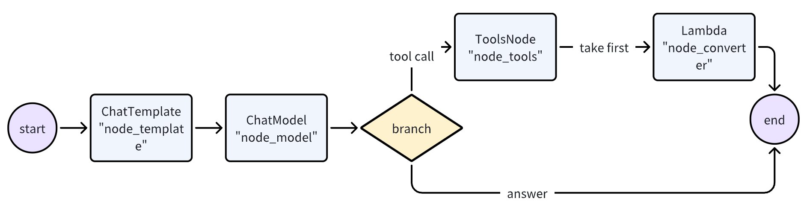
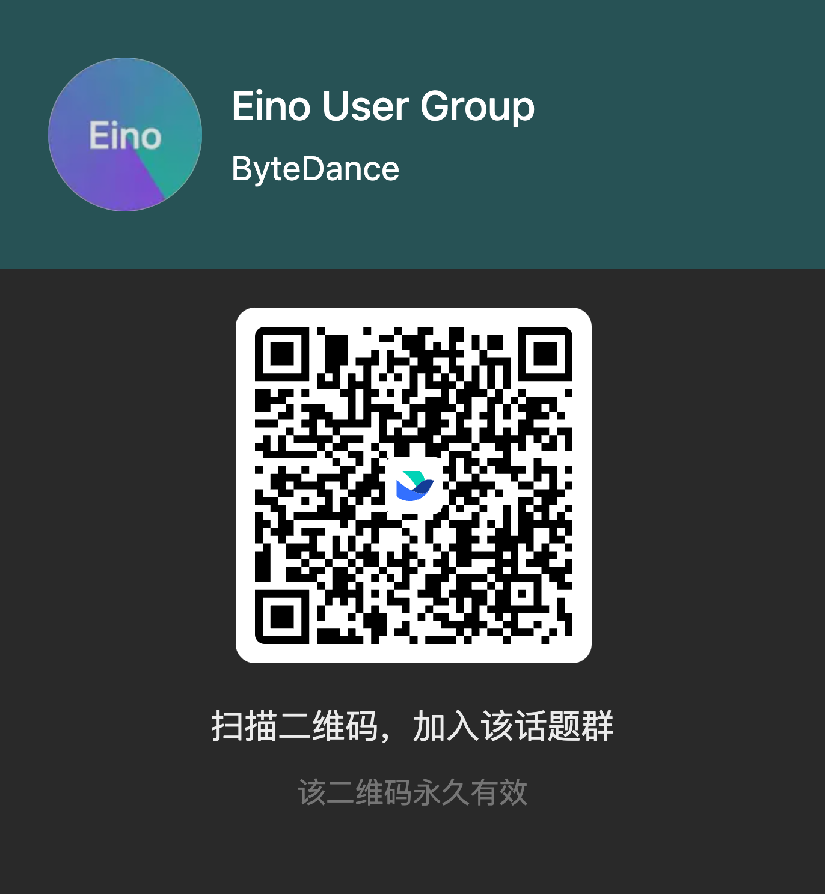

# Eino


[](https://github.com/cloudwego/eino/releases)
[](https://www.cloudwego.io/)
[](https://github.com/cloudwego/eino/blob/main/LICENSE)
[](https://goreportcard.com/report/github.com/cloudwego/eino)
[](https://github.com/cloudwego/kitex/eino)
[](https://github.com/cloudwego/eino/issues?q=is%3Aissue+is%3Aclosed)


English | [中文](README.zh_CN.md)

# Overview

**Eino['aino]** is an LLM application development framework in Golang. It draws from LangChain, Google ADK, and other open-source frameworks, and is designed to follow Golang conventions.

Eino provides:
- **Component** abstractions and implementations for building LLM applications
- An **Agent Development Kit (ADK)** for building AI agents with multi-agent orchestration, human-in-the-loop interrupts, and prebuilt agent patterns
- A **composition** framework that handles type checking, stream processing, concurrency management, aspect injection, and option assignment
- **APIs** designed for simplicity and clarity
- Bundled **flows** and **examples**
- Tools for visualized development, debugging, tracing, and evaluation


# A quick walkthrough

Use a component directly:
```Go
model, _ := openai.NewChatModel(ctx, config) // create an invokable LLM instance
message, _ := model.Generate(ctx, []*Message{
    SystemMessage("you are a helpful assistant."),
    UserMessage("what does the future AI App look like?")})
```

You can use components directly, but orchestration provides additional benefits:
- Encapsulates common LLM application patterns
- Handles stream response processing
- Manages type safety, concurrency, aspect injection, and option assignment

Eino provides three orchestration APIs:

| API      | Characteristics and usage                                             |
| -------- |-----------------------------------------------------------------------|
| Chain    | Simple chained directed graph that can only go forward.               |
| Graph    | Cyclic or Acyclic directed graph. Powerful and flexible.              |
| Workflow | Acyclic graph that supports data mapping at struct field level. |

A simple chain: ChatTemplate followed by ChatModel.


```Go
chain, _ := NewChain[map[string]any, *Message]().
           AppendChatTemplate(prompt).
           AppendChatModel(model).
           Compile(ctx)

chain.Invoke(ctx, map[string]any{"query": "what's your name?"})
```

A graph that uses ChatModel to generate answers or tool calls, then uses ToolsNode to execute tools if needed.



```Go
graph := NewGraph[map[string]any, *schema.Message]()

_ = graph.AddChatTemplateNode("node_template", chatTpl)
_ = graph.AddChatModelNode("node_model", chatModel)
_ = graph.AddToolsNode("node_tools", toolsNode)
_ = graph.AddLambdaNode("node_converter", takeOne)

_ = graph.AddEdge(START, "node_template")
_ = graph.AddEdge("node_template", "node_model")
_ = graph.AddBranch("node_model", branch)
_ = graph.AddEdge("node_tools", "node_converter")
_ = graph.AddEdge("node_converter", END)

compiledGraph, err := graph.Compile(ctx)
if err != nil {
return err
}
out, err := compiledGraph.Invoke(ctx, map[string]any{"query":"Beijing's weather this weekend"})
```

A workflow with field-level input/output mapping:


```Go
type Input1 struct {
    Input string
}

type Output1 struct {
    Output string
}

type Input2 struct {
    Role schema.RoleType
}

type Output2 struct {
    Output string
}

type Input3 struct {
    Query string
    MetaData string
}

var (
    ctx context.Context
    m model.BaseChatModel
    lambda1 func(context.Context, Input1) (Output1, error)
    lambda2 func(context.Context, Input2) (Output2, error)
    lambda3 func(context.Context, Input3) (*schema.Message, error)
)

wf := NewWorkflow[[]*schema.Message, *schema.Message]()
wf.AddChatModelNode("model", m).AddInput(START)
wf.AddLambdaNode("lambda1", InvokableLambda(lambda1)).
    AddInput("model", MapFields("Content", "Input"))
wf.AddLambdaNode("lambda2", InvokableLambda(lambda2)).
    AddInput("model", MapFields("Role", "Role"))
wf.AddLambdaNode("lambda3", InvokableLambda(lambda3)).
    AddInput("lambda1", MapFields("Output", "Query")).
    AddInput("lambda2", MapFields("Output", "MetaData"))
wf.End().AddInput("lambda3")
runnable, err := wf.Compile(ctx)
if err != nil {
    return err
}
our, err := runnable.Invoke(ctx, []*schema.Message{
    schema.UserMessage("kick start this workflow!"),
})
```

**Graph orchestration** provides:
- Type checking: ensures node input/output types match at compile time
- Stream processing: concatenates message streams before passing to chatModel and toolsNode, copies streams to callback handlers
- Concurrency management: StatePreHandler is concurrency safe for shared state
- Aspect injection: injects callback aspects before and after ChatModel execution
- Option assignment: call options can be assigned globally, to specific component types, or to specific nodes

Extend compiled graphs with callbacks:
```Go
handler := NewHandlerBuilder().
  OnStartFn(
    func(ctx context.Context, info *RunInfo, input CallbackInput) context.Context) {
        log.Infof("onStart, runInfo: %v, input: %v", info, input)
    }).
  OnEndFn(
    func(ctx context.Context, info *RunInfo, output CallbackOutput) context.Context) {
        log.Infof("onEnd, runInfo: %v, out: %v", info, output)
    }).
  Build()
  
compiledGraph.Invoke(ctx, input, WithCallbacks(handler))
```

Assign options to different nodes:
```Go
// assign to All nodes
compiledGraph.Invoke(ctx, input, WithCallbacks(handler))

// assign only to ChatModel nodes
compiledGraph.Invoke(ctx, input, WithChatModelOption(WithTemperature(0.5))

// assign only to node_1
compiledGraph.Invoke(ctx, input, WithCallbacks(handler).DesignateNode("node_1"))
```

A ReAct agent: ChatModel binds to Tools, receives input Messages, and decides whether to call Tools or output the final result. Tool execution results become input Messages for the next round.


The **Agent Development Kit (ADK)** provides `ChatModelAgent` for this pattern:

```Go
agent, _ := adk.NewChatModelAgent(ctx, &adk.ChatModelAgentConfig{
    Name:        "assistant",
    Description: "A helpful assistant that can use tools",
    Model:       chatModel,
    ToolsConfig: adk.ToolsConfig{
        ToolsNodeConfig: compose.ToolsNodeConfig{
            Tools: []tool.BaseTool{weatherTool, calculatorTool},
        },
    },
})

runner := adk.NewRunner(ctx, adk.RunnerConfig{Agent: agent})
iter := runner.Query(ctx, "What's the weather in Beijing this weekend?")
for {
    event, ok := iter.Next()
    if !ok {
        break
    }
    // process agent events (model outputs, tool calls, etc.)
}
```

The ADK handles the ReAct loop internally, emitting events for each step.

ADK also provides:

**Multi-Agent with Context Management**: Agents can transfer control to sub-agents or be wrapped as tools. The framework manages conversation context across agent boundaries:

```Go
// Set up agent hierarchy - mainAgent can now transfer to sub-agents
mainAgentWithSubs, _ := adk.SetSubAgents(ctx, mainAgent, []adk.Agent{researchAgent, codeAgent})
```

When `mainAgent` transfers to `researchAgent`, conversation history is rewritten to provide context for the sub-agent.

Agents can be wrapped as tools:

```Go
// Wrap an agent as a tool that can be called by other agents
researchTool := adk.NewAgentTool(ctx, researchAgent)
```

**Interrupt and Resume**: Any agent can pause execution for human approval or external input:

```Go
// Inside a tool or agent, trigger an interrupt
return adk.Interrupt(ctx, "Please confirm this action")

// Later, resume from checkpoint
iter, _ := runner.Resume(ctx, checkpointID)
```

**Prebuilt Agent Patterns**:

```Go
// Deep Agent: task orchestration with task management, sub-agent delegation, and progress tracking
deepAgent, _ := deep.New(ctx, &deep.Config{
    Name:        "deep_agent",
    Description: "An agent that breaks down and executes complex tasks",
    ChatModel:   chatModel,
    SubAgents:   []adk.Agent{researchAgent, codeAgent},
    ToolsConfig: adk.ToolsConfig{...},
})

// Supervisor pattern: one agent coordinates multiple specialists
supervisorAgent, _ := supervisor.New(ctx, &supervisor.Config{
    Supervisor: coordinatorAgent,
    SubAgents:  []adk.Agent{writerAgent, reviewerAgent},
})

// Sequential execution: agents run one after another
seqAgent, _ := adk.NewSequentialAgent(ctx, &adk.SequentialAgentConfig{
    SubAgents: []adk.Agent{plannerAgent, executorAgent, summarizerAgent},
})
```

**Middleware System**: Add capabilities to agents without modifying their core logic:

```Go
fsMiddleware, _ := filesystem.NewMiddleware(ctx, &filesystem.Config{
    Backend: myFileSystem,
})

agent, _ := adk.NewChatModelAgent(ctx, &adk.ChatModelAgentConfig{
    // ...
    Middlewares: []adk.AgentMiddleware{fsMiddleware},
})
```

# Key Features

## Components

- **Component abstractions** with multiple **implementations** ready to use
    - Abstractions include ChatModel, Tool, ChatTemplate, Retriever, Document Loader, Lambda, etc.
    - Each component type has its own interface: defined Input & Output types, Option types, and streaming paradigms
    - Implementations are transparent when orchestrating components

- Implementations can be nested and capture complex business logic
    - ReAct Agent, MultiQueryRetriever, Host MultiAgent, etc. consist of multiple components and non-trivial logic
    - They remain transparent from the outside. A MultiQueryRetriever can be used anywhere that accepts a Retriever

## Agent Development Kit (ADK)

The **ADK** package provides abstractions for building AI agents:

- **ChatModelAgent**: A ReAct-style agent that handles tool calling, conversation state, and the reasoning loop
- **Multi-Agent with Context Engineering**: Hierarchical agent systems where conversation history is managed across agent transfers and agent-as-tool invocations
- **Workflow Agents**: Compose agents using `SequentialAgent`, `ParallelAgent`, and `LoopAgent`
- **Human-in-the-Loop**: `Interrupt` and `Resume` mechanisms with checkpoint persistence
- **Prebuilt Patterns**: Deep Agent (task orchestration), Supervisor (hierarchical coordination), and Plan-Execute-Replan
- **Agent Middlewares**: Extensible middleware system for adding tools and managing context

## Orchestration

**Graph orchestration** provides fine-grained control over data flow from Retriever / Document Loaders / ChatTemplate to ChatModel, then to Tools and final output.

- Component instances are graph nodes; edges are data flow channels
- Features:
  - Type checking, stream processing, concurrency management, aspect injection, and option assignment
  - Runtime branching, global state read/write, field-level data mapping via workflow

## Aspects (Callbacks)

**Aspects** handle cross-cutting concerns: logging, tracing, and metrics. They can be applied to components, orchestrated graphs, or ADK agents.

- Five aspect types: OnStart, OnEnd, OnError, OnStartWithStreamInput, OnEndWithStreamOutput
- Custom callback handlers can be added at runtime via options

## Stream Processing

ChatModel outputs message chunks in real time. Eino handles streaming throughout orchestration:

- **Concatenates** stream chunks for downstream nodes that accept non-stream input (e.g., ToolsNode)
- **Boxes** non-stream into stream when needed during graph execution
- **Merges** multiple streams when they converge into a single node
- **Copies** streams when they fan out to different nodes or callback handlers
- **Branch** and **state handlers** are stream-aware

A compiled Graph supports 4 streaming paradigms:

| Streaming Paradigm | Explanation                                                                 |
| ------------------ | --------------------------------------------------------------------------- |
| Invoke             | Accepts non-stream type I and returns non-stream type O                     |
| Stream             | Accepts non-stream type I and returns stream type StreamReader[O]           |
| Collect            | Accepts stream type StreamReader[I] and returns non-stream type O           |
| Transform          | Accepts stream type StreamReader[I] and returns stream type StreamReader[O] |

# Framework Structure


The Eino framework consists of:

- Eino (this repo): Type definitions, streaming mechanism, component abstractions, orchestration, agent implementations, aspect mechanisms

- [EinoExt](https://github.com/cloudwego/eino-ext): Component implementations, callback handlers, usage examples, evaluators, prompt optimizers

- [Eino Devops](https://github.com/cloudwego/eino-ext/tree/main/devops): Visualized development and debugging

- [EinoExamples](https://github.com/cloudwego/eino-examples): Example applications and best practices

## Documentation

- [Eino User Manual](https://www.cloudwego.io/zh/docs/eino/)
- [Eino: Quick Start](https://www.cloudwego.io/zh/docs/eino/quick_start/)

## Dependencies
- Go 1.18 and above.

## Code Style

This repo uses `golangci-lint`. Check locally with:

```bash
golangci-lint run ./...
```

Rules enforced:
- Exported functions, interfaces, packages, etc. should have GoDoc comments
- Code should be formatted with `gofmt -s`
- Import order should follow `goimports` (std -> third party -> local)

## Security

If you discover a potential security issue, notify Bytedance Security via the [security center](https://security.bytedance.com/src) or [vulnerability reporting email](sec@bytedance.com).

Do **not** create a public GitHub issue.

## Contact
- Membership: [COMMUNITY MEMBERSHIP](https://github.com/cloudwego/community/blob/main/COMMUNITY_MEMBERSHIP.md)
- Issues: [Issues](https://github.com/cloudwego/eino/issues)
- Lark: Scan the QR code below with [Feishu](https://www.feishu.cn/en/) to join the CloudWeGo/eino user group.

&ensp;&ensp;&ensp; 

## License

This project is licensed under the [Apache-2.0 License](LICENSE-APACHE).
