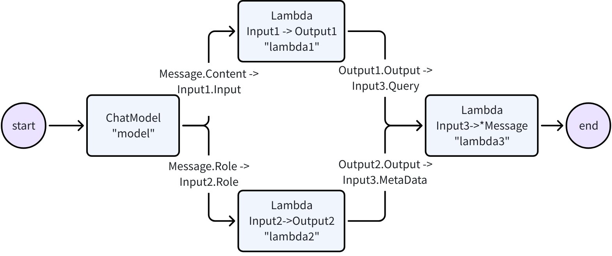

# Eino


[](https://github.com/cloudwego/eino/releases)
[](https://www.cloudwego.io/)
[](https://github.com/cloudwego/eino/blob/main/LICENSE)
[](https://goreportcard.com/report/github.com/cloudwego/eino)
[](https://github.com/cloudwego/kitex/eino)
[](https://github.com/cloudwego/eino/issues?q=is%3Aissue+is%3Aclosed)


[English](README.md) | 中文

# 简介

**Eino['aino]** 是一个用 Go 语言编写的 LLM 应用开发框架。它借鉴了 LangChain、Google ADK 等开源框架，并遵循 Go 语言编程惯例。

Eino 提供：
- 用于构建 LLM 应用的**组件**抽象与实现
- **智能体开发套件（ADK）**，用于构建 AI 智能体，支持多智能体编排、人机协作中断机制和预置智能体模式
- **编排**框架，处理类型检查、流式处理、并发管理、切面注入和选项赋值
- 简洁清晰的 **API**
- 集成的**流程**和**示例**
- 可视化开发、调试、追踪和评估**工具**


# 快速上手

直接使用组件：
```Go
model, _ := openai.NewChatModel(ctx, config) // create an invokable LLM instance
message, _ := model.Generate(ctx, []*Message{
    SystemMessage("you are a helpful assistant."),
    UserMessage("what does the future AI App look like?")})
```

可以直接使用组件，但编排提供额外能力：
- 封装 LLM 应用的常见模式
- 处理流式响应
- 管理类型安全、并发、切面注入和选项赋值

Eino 提供三组编排 API：

| API      | 特性和使用场景                     |
| -------- |-----------------------------|
| Chain    | 简单的链式有向图，只能向前推进。            |
| Graph    | 循环或非循环有向图，功能强大且灵活。          |
| Workflow | 非循环图，支持在结构体字段级别进行数据映射。 |

一个简单的 chain：ChatTemplate 接 ChatModel。


```Go
chain, _ := NewChain[map[string]any, *Message]().
           AppendChatTemplate(prompt).
           AppendChatModel(model).
           Compile(ctx)

chain.Invoke(ctx, map[string]any{"query": "what's your name?"})
```

一个 Graph：用 ChatModel 生成回复或 Tool 调用指令，如生成了 Tool 调用指令，用 ToolsNode 执行这些 Tool。


```Go
graph := NewGraph[map[string]any, *schema.Message]()

_ = graph.AddChatTemplateNode("node_template", chatTpl)
_ = graph.AddChatModelNode("node_model", chatModel)
_ = graph.AddToolsNode("node_tools", toolsNode)
_ = graph.AddLambdaNode("node_converter", takeOne)

_ = graph.AddEdge(START, "node_template")
_ = graph.AddEdge("node_template", "node_model")
_ = graph.AddBranch("node_model", branch)
_ = graph.AddEdge("node_tools", "node_converter")
_ = graph.AddEdge("node_converter", END)

compiledGraph, err := graph.Compile(ctx)
if err != nil {
return err
}
out, err := compiledGraph.Invoke(ctx, map[string]any{"query":"Beijing's weather this weekend"})
```

一个 Workflow，支持字段级别的输入输出映射：



```Go
type Input1 struct {
    Input string
}

type Output1 struct {
    Output string
}

type Input2 struct {
    Role schema.RoleType
}

type Output2 struct {
    Output string
}

type Input3 struct {
    Query string
    MetaData string
}

var (
    ctx context.Context
    m model.BaseChatModel
    lambda1 func(context.Context, Input1) (Output1, error)
    lambda2 func(context.Context, Input2) (Output2, error)
    lambda3 func(context.Context, Input3) (*schema.Message, error)
)

wf := NewWorkflow[[]*schema.Message, *schema.Message]()
wf.AddChatModelNode("model", m).AddInput(START)
wf.AddLambdaNode("lambda1", InvokableLambda(lambda1)).
    AddInput("model", MapFields("Content", "Input"))
wf.AddLambdaNode("lambda2", InvokableLambda(lambda2)).
    AddInput("model", MapFields("Role", "Role"))
wf.AddLambdaNode("lambda3", InvokableLambda(lambda3)).
    AddInput("lambda1", MapFields("Output", "Query")).
    AddInput("lambda2", MapFields("Output", "MetaData"))
wf.End().AddInput("lambda3")
runnable, err := wf.Compile(ctx)
if err != nil {
    return err
}
our, err := runnable.Invoke(ctx, []*schema.Message{
    schema.UserMessage("kick start this workflow!"),
})
```

**图编排**提供：
- 类型检查：在编译时确保节点输入输出类型匹配
- 流处理：在传递给 chatModel 和 toolsNode 之前拼接消息流，将流复制到 callback handler
- 并发管理：StatePreHandler 是线程安全的，共享 state 可以安全读写
- 切面注入：在 ChatModel 执行前后注入回调切面
- 选项赋值：调用 Option 可以全局设置，也可以针对特定组件类型或特定节点设置

通过回调扩展已编译的图：
```Go
handler := NewHandlerBuilder().
  OnStartFn(
    func(ctx context.Context, info *RunInfo, input CallbackInput) context.Context) {
        log.Infof("onStart, runInfo: %v, input: %v", info, input)
    }).
  OnEndFn(
    func(ctx context.Context, info *RunInfo, output CallbackOutput) context.Context) {
        log.Infof("onEnd, runInfo: %v, out: %v", info, output)
    }).
  Build()
  
compiledGraph.Invoke(ctx, input, WithCallbacks(handler))
```

为不同节点分配选项：
```Go
// assign to All nodes
compiledGraph.Invoke(ctx, input, WithCallbacks(handler))

// assign only to ChatModel nodes
compiledGraph.Invoke(ctx, input, WithChatModelOption(WithTemperature(0.5))

// assign only to node_1
compiledGraph.Invoke(ctx, input, WithCallbacks(handler).DesignateNode("node_1"))
```

ReAct 智能体：ChatModel 绑定 Tool，接收输入消息，判断是调用 Tool 还是输出最终结果。Tool 执行结果成为下一轮的输入消息。


**智能体开发套件（ADK）** 提供 `ChatModelAgent` 实现这一模式：

```Go
agent, _ := adk.NewChatModelAgent(ctx, &adk.ChatModelAgentConfig{
    Name:        "assistant",
    Description: "A helpful assistant that can use tools",
    Model:       chatModel,
    ToolsConfig: adk.ToolsConfig{
        ToolsNodeConfig: compose.ToolsNodeConfig{
            Tools: []tool.BaseTool{weatherTool, calculatorTool},
        },
    },
})

runner := adk.NewRunner(ctx, adk.RunnerConfig{Agent: agent})
iter := runner.Query(ctx, "What's the weather in Beijing this weekend?")
for {
    event, ok := iter.Next()
    if !ok {
        break
    }
    // process agent events (model outputs, tool calls, etc.)
}
```

ADK 在内部处理 ReAct 循环，为每个步骤发出事件。

ADK 还提供：

**多智能体与上下文管理**：智能体可以将控制权转移给子智能体，或被封装为工具。框架管理跨智能体边界的对话上下文：

```Go
// 设置智能体层级 - mainAgent 现在可以转移到子智能体
mainAgentWithSubs, _ := adk.SetSubAgents(ctx, mainAgent, []adk.Agent{researchAgent, codeAgent})
```

当 `mainAgent` 转移到 `researchAgent` 时，对话历史会重写以提供上下文。

智能体可以被封装为工具：

```Go
// 将智能体封装为可被其他智能体调用的工具
researchTool := adk.NewAgentTool(ctx, researchAgent)
```

**中断与恢复**：任何智能体都可以暂停执行以等待人工审批或外部输入：

```Go
// 在工具或智能体内部，触发中断
return adk.Interrupt(ctx, "Please confirm this action")

// 稍后，从检查点恢复
iter, _ := runner.Resume(ctx, checkpointID)
```

**预置智能体模式**：

```Go
// Deep Agent：任务编排，支持任务管理、子智能体委派和进度跟踪
deepAgent, _ := deep.New(ctx, &deep.Config{
    Name:        "deep_agent",
    Description: "An agent that breaks down and executes complex tasks",
    ChatModel:   chatModel,
    SubAgents:   []adk.Agent{researchAgent, codeAgent},
    ToolsConfig: adk.ToolsConfig{...},
})

// Supervisor 模式：一个智能体协调多个专家
supervisorAgent, _ := supervisor.New(ctx, &supervisor.Config{
    Supervisor: coordinatorAgent,
    SubAgents:  []adk.Agent{writerAgent, reviewerAgent},
})

// 顺序执行：智能体依次运行
seqAgent, _ := adk.NewSequentialAgent(ctx, &adk.SequentialAgentConfig{
    SubAgents: []adk.Agent{plannerAgent, executorAgent, summarizerAgent},
})
```

**中间件系统**：在不修改核心逻辑的情况下为智能体添加能力：

```Go
fsMiddleware, _ := filesystem.NewMiddleware(ctx, &filesystem.Config{
    Backend: myFileSystem,
})

agent, _ := adk.NewChatModelAgent(ctx, &adk.ChatModelAgentConfig{
    // ...
    Middlewares: []adk.AgentMiddleware{fsMiddleware},
})
```

# 关键特性

## 组件

- **组件抽象**与多个可用的**实现**
    - 抽象包括 ChatModel、Tool、ChatTemplate、Retriever、Document Loader、Lambda 等
    - 每种组件类型有其自身接口：定义的输入输出类型、Option 类型和流处理范式
    - 编排组件时，实现细节是透明的

- 实现可以嵌套，包含复杂业务逻辑
    - ReAct Agent、MultiQueryRetriever、Host MultiAgent 等由多个组件和复杂逻辑构成
    - 从外部看仍然透明。MultiQueryRetriever 可以用在任何接受 Retriever 的地方

## 智能体开发套件（ADK）

**ADK** 包提供构建 AI 智能体的抽象：

- **ChatModelAgent**：ReAct 风格的智能体，处理工具调用、对话状态和推理循环
- **多智能体与上下文工程**：层级化智能体系统，对话历史在智能体转移和智能体作为工具调用时自动管理
- **工作流智能体**：使用 `SequentialAgent`、`ParallelAgent` 和 `LoopAgent` 组合智能体
- **人机协作**：`Interrupt` 和 `Resume` 机制，支持检查点持久化
- **预置模式**：Deep Agent（任务编排）、Supervisor（层级协调）和 Plan-Execute-Replan
- **智能体中间件**：可扩展的中间件系统，用于添加工具和管理上下文

## 编排

**图编排**提供细粒度控制，数据从 Retriever / Document Loader / ChatTemplate 流向 ChatModel，再到 Tool 和最终输出。

- 组件实例是图节点，边是数据流通道
- 特性：
  - 类型检查、流处理、并发管理、切面注入和选项赋值
  - 运行时分支、全局状态读写、通过 workflow 进行字段级别数据映射

## 切面（Callbacks）

**切面**处理横切关注点：日志记录、追踪和指标统计。可应用于组件、编排图或 ADK 智能体。

- 五种切面类型：OnStart、OnEnd、OnError、OnStartWithStreamInput、OnEndWithStreamOutput
- 可通过 Option 在运行时添加自定义回调处理程序

## 流式处理

ChatModel 实时输出消息块。Eino 在编排中处理流式：

- 对于只接受非流式输入的下游节点（如 ToolsNode），**拼接**流块
- 在图执行中需要流时，将非流式**转换**为流式
- 当多个流汇聚到单个节点时，**合并**流
- 当流分散到不同节点或回调处理器时，**复制**流
- **分支**和**状态处理器**支持流感知

编译后的 Graph 支持 4 种流式范式：

| 流处理范式     | 解释                                               |
|-----------|-----------------------------------------------|
| Invoke    | 接收非流类型 I，返回非流类型 O                            |
| Stream    | 接收非流类型 I，返回流类型 StreamReader[O]              |
| Collect   | 接收流类型 StreamReader[I]，返回非流类型 O              |
| Transform | 接收流类型 StreamReader[I]，返回流类型 StreamReader[O] |

# 框架结构


Eino 框架包含：

- Eino（本仓库）：类型定义、流处理机制、组件抽象、编排、智能体实现、切面机制

- [EinoExt](https://github.com/cloudwego/eino-ext)：组件实现、回调处理程序、使用示例、评估器、提示优化器

- [Eino Devops](https://github.com/cloudwego/eino-ext/tree/main/devops)：可视化开发和调试

- [EinoExamples](https://github.com/cloudwego/eino-examples)：示例应用和最佳实践

## 文档

- [Eino 用户手册](https://www.cloudwego.io/zh/docs/eino/)
- [Eino: 快速开始](https://www.cloudwego.io/zh/docs/eino/quick_start/)

## 依赖
- Go 1.18 及以上版本

## 代码规范

本仓库使用 `golangci-lint`。本地检查：

```bash
golangci-lint run ./...
```

规则：
- 导出的函数、接口、package 等需要 GoDoc 注释
- 代码格式需符合 `gofmt -s`
- import 顺序需符合 `goimports`（std -> third party -> local）

## 安全

如果发现潜在安全问题，请通过[安全中心](https://security.bytedance.com/src)或[漏洞报告邮箱](sec@bytedance.com)通知字节跳动安全团队。

请**不要**创建公开的 GitHub Issue。

## 联系我们
- 成为 member：[COMMUNITY MEMBERSHIP](https://github.com/cloudwego/community/blob/main/COMMUNITY_MEMBERSHIP.md)
- Issues：[Issues](https://github.com/cloudwego/eino/issues)
- 飞书：用 [飞书](https://www.feishu.cn/) 扫码加入 CloudWeGo/eino 用户群

&ensp;&ensp;&ensp; 

## 开源许可证

本项目依据 [Apache-2.0 许可证](LICENSE-APACHE) 授权。
