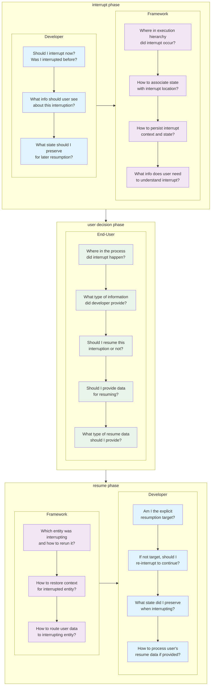
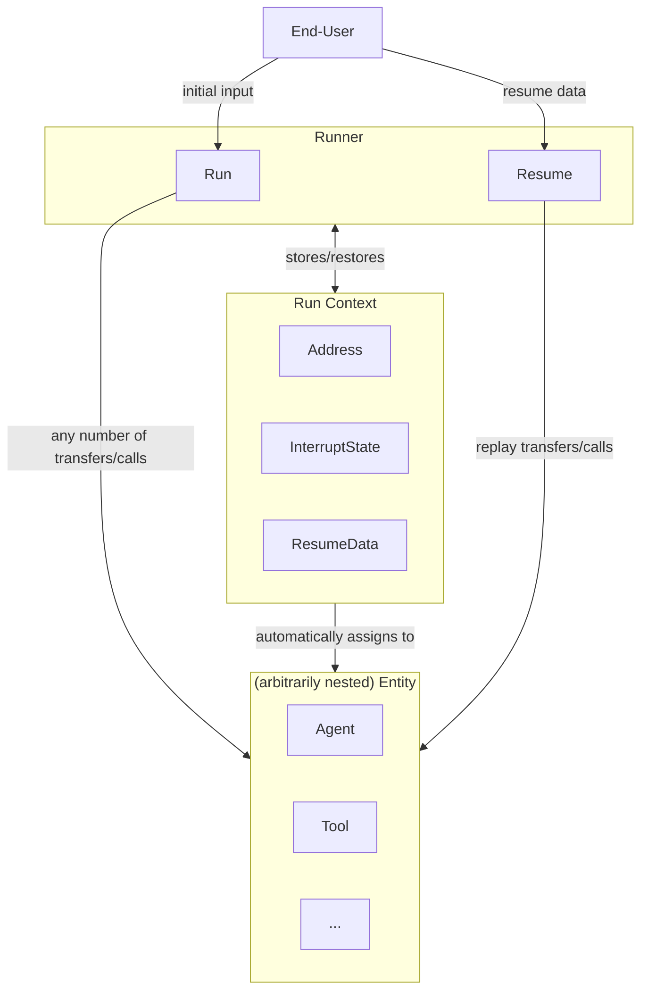
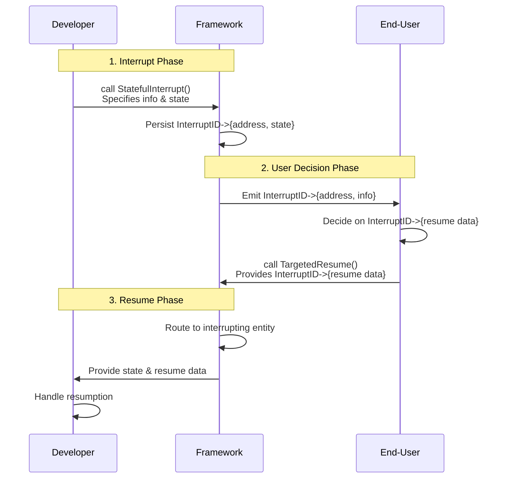
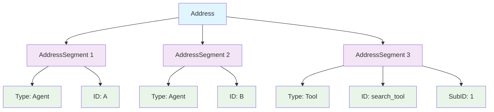
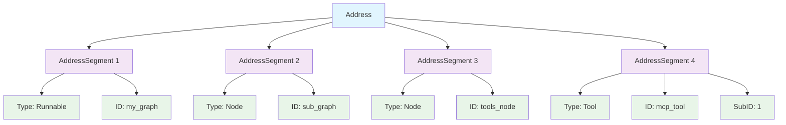

# Eino Human-in-the-Loop Framework: Technical Architecture Guide

## Overview

This document provides technical details about Eino's Human-in-the-Loop (HITL) framework architecture, focusing on the interrupt/resume mechanism and the underlying addressing system.

## Alpha Release Notice

> **Note**: The Human-in-the-Loop framework described in this document is an **alpha feature**.

- **Release Tag**: `v0.6.0-alpha1`
- **Stability**: APIs and functionality may change before the official release.
- **Alpha Period**: The alpha phase is expected to conclude before the end of November 2025.

We welcome feedback and contributions during this phase to help us improve the framework.

## Human-in-the-Loop Requirements

The following diagram illustrates the key questions each component must answer during the interrupt/resume process. Understanding these requirements is key to grasping why the architecture is structured as it is.



So our goals are:
1. Help developer answer the above questions as easy as possible.
2. Help end-user answer the above questions as easy as possible.
3. Enable the framework to answer the above questions automatically and out of the box.

## Architectural Overview

The following flowchart illustrates the high-level interrupt/resume flow:



The following sequence diagram shows the chronological flow of interactions between the three main actors:




## ADK Package APIs

The ADK package provides high-level abstractions for building interruptible agents with human-in-the-loop capabilities.

### 1. APIs for Interruption

#### `Interrupt`
Creates a basic interrupt action. This is used when an agent needs to pause its execution to request external input or intervention, but does not need to save any internal state to be restored upon resumption.

```go
func Interrupt(ctx context.Context, info any) *AgentEvent
```

**Parameters:**
- `ctx`: The context of the running component.
- `info`: User-facing data that describes the reason for the interrupt.

**Returns:** `*AgentEvent` with an interrupt action.

**Example:**
```go
// Inside an agent's Run method:

// Create a simple interrupt to ask for clarification.
return adk.Interrupt(ctx, "The user query was ambiguous. Please clarify.")
```

---

#### `StatefulInterrupt`
Creates an interrupt action that also saves the agent's internal state. This is used when an agent has internal state that must be restored for it to continue correctly.

```go
func StatefulInterrupt(ctx context.Context, info any, state any) *AgentEvent
```

**Parameters:**
- `ctx`: The context of the running component.
- `info`: User-facing data describing the interrupt.
- `state`: The agent's internal state object, which will be serialized and stored.

**Returns:** `*AgentEvent` with an interrupt action.

**Example:**
```go
// Inside an agent's Run method:

// Define the state to be saved.
type MyAgentState struct {
    ProcessedItems int
    CurrentTopic   string
}

currentState := &MyAgentState{
    ProcessedItems: 42,
    CurrentTopic:   "HITL",
}

// Interrupt and save the current state.
return adk.StatefulInterrupt(ctx, "Need user feedback before proceeding", currentState)
```

---

#### `CompositeInterrupt`
Creates an interrupt action for a component that orchestrates multiple sub-components. It combines the interrupts from one or more of its sub-agents into a single, cohesive interrupt. This is used by any agent that contains sub-agents (e.g., a custom Sequential or Parallel agent) to propagate interrupts from its children.

```go
func CompositeInterrupt(ctx context.Context, info any, state any, 
    subInterruptSignals ...*InterruptSignal) *AgentEvent
```

**Parameters:**
- `ctx`: The context of the running component.
- `info`: User-facing data describing the orchestrator's own reason for interrupting.
- `state`: The orchestrator agent's own state (e.g., the index of the sub-agent that was interrupted).
- `subInterruptSignals`: A variadic list of the `InterruptSignal` objects from the interrupted sub-agents.

**Returns:** `*AgentEvent` with an interrupt action.

**Example:**
```go
// In a custom sequential agent that runs two sub-agents...
subAgent1 := &myInterruptingAgent{}
subAgent2 := &myOtherAgent{}

// If subAgent1 returns an interrupt event...
subInterruptEvent := subAgent1.Run(ctx, input)

// The parent agent must catch it and wrap it in a CompositeInterrupt.
if subInterruptEvent.Action.Interrupted != nil {
    // The parent can add its own state, like which child was interrupted.
    parentState := map[string]int{"interrupted_child_index": 0}
    
    // Propagate the interrupt up.
    return adk.CompositeInterrupt(ctx, 
        "A sub-agent needs attention", 
        parentState, 
        subInterruptEvent.Action.Interrupted.internalInterrupted,
    )
}
```

### 2. APIs for Fetching Interrupt Information

#### `InterruptInfo` and `InterruptCtx`
When an agent execution is interrupted, the `AgentEvent` contains structured interrupt information. The `InterruptInfo` struct contains a list of `InterruptCtx` objects, each representing a single point of interruption in the hierarchy.

An `InterruptCtx` provides a complete, user-facing context for a single, resumable interrupt point.

```go
type InterruptCtx struct {
    // ID is the unique, fully-qualified address of the interrupt point, used for targeted resumption.
    // e.g., "agent:A;node:graph_a;tool:tool_call_123"
    ID string

    // Address is the structured sequence of AddressSegment segments that leads to the interrupt point.
    Address Address

    // Info is the user-facing information associated with the interrupt, provided by the component that triggered it.
    Info any

    // IsRootCause indicates whether the interrupt point is the exact root cause for an interruption.
    IsRootCause bool

    // Parent points to the context of the parent component in the interrupt chain (nil for the top-level interrupt).
    Parent *InterruptCtx
}
```

The following example shows how to access this information:

```go
// In the application layer, after an interrupt:
if event.Action != nil && event.Action.Interrupted != nil {
    interruptInfo := event.Action.Interrupted
    
    // Get a flat list of all interrupt points
    interruptPoints := interruptInfo.InterruptContexts 
    
    for _, point := range interruptPoints {
        // Each point contains a unique ID, user-facing info, and its hierarchical address
        fmt.Printf("Interrupt ID: %s, Address: %s, Info: %v\n", point.ID, point.Address.String(), point.Info)
    }
}
```

### 3. APIs for End-User Resumption

#### `(*Runner).TargetedResume`
Continues an interrupted execution from a checkpoint, using an "Explicit Targeted Resume" strategy. This is the most common and powerful way to resume, allowing you to target specific interrupt points and provide them with data.

When using this method:
- Components whose addresses are in the `targets` map will be the explicit target.
- Interrupted components whose addresses are NOT in the `targets` map must re-interrupt themselves to preserve their state.

```go
func (r *Runner) TargetedResume(ctx context.Context, checkPointID string, 
    targets map[string]any, opts ...AgentRunOption) (*AsyncIterator[*AgentEvent], error)
```

**Parameters:**
- `ctx`: Context for resumption.
- `checkPointID`: Identifier for the checkpoint to resume from.
- `targets`: Map of interrupt IDs to resume data. These IDs can point to any interruptible component in the entire execution graph.
- `opts`: Additional run options.

**Returns:** An async iterator for agent events.

**Example:**
```go
// After receiving an interrupt event...
interruptID := interruptEvent.Action.Interrupted.InterruptContexts[0].ID

// Prepare the data for the specific interrupt point.
resumeData := map[string]any{
    interruptID: "Here is the clarification you requested.",
}

// Resume the execution with the targeted data.
resumeIterator, err := runner.TargetedResume(ctx, "my-checkpoint-id", resumeData)
if err != nil {
    // Handle error
}

// Process events from the resume iterator
for event := range resumeIterator.Events() {
    if event.Err != nil {
        // Handle event error
        break
    }
    // Process the agent event
    fmt.Printf("Event: %+v\n", event)
}
```

### 4. APIs for Developer Resumption

#### `ResumeInfo` Struct
`ResumeInfo` holds all the information necessary to resume an interrupted agent execution. It is created by the framework and passed to an agent's `Resume` method.

```go
type ResumeInfo struct {
    // WasInterrupted indicates if this agent was a direct source of interrupt.
    WasInterrupted bool

    // InterruptState holds the state saved with StatefulInterrupt or CompositeInterrupt.
    InterruptState any

    // IsResumeTarget indicates if this agent was the specific target of TargetedResume.
    IsResumeTarget bool

    // ResumeData holds the data provided by the user for this agent.
    ResumeData any

    // ... other fields
}
```

**Example:**
```go
import (
    "context"
    "errors"
    "fmt"
    
    "github.com/cloudwego/eino/adk"
)

// Inside an agent's Resume method:
func (a *myAgent) Resume(ctx context.Context, info *adk.ResumeInfo, opts ...adk.AgentRunOption) *adk.AsyncIterator[*adk.AgentEvent] {
    if !info.WasInterrupted {
        // Should not happen in a resume flow.
        return adk.NewAsyncIterator([]*adk.AgentEvent{{Err: errors.New("not an interrupt")}}, nil)
    }

    if !info.IsResumeTarget {
        // This agent was not the specific target, so it must re-interrupt to preserve its state.
        return adk.StatefulInterrupt(ctx, "Waiting for another part of the workflow to be resumed", info.InterruptState)
    }

    // This agent IS the target. Process the resume data.
    if info.ResumeData != nil {
        userInput, ok := info.ResumeData.(string)
        if ok {
            // Process the user input and continue execution
            fmt.Printf("Received user input: %s\n", userInput)
            // Update agent state based on user input
            a.currentState.LastUserInput = userInput
        }
    }
    
    // Continue with normal execution logic
    return a.Run(ctx, &adk.AgentInput{Input: "resumed execution"})
}
```

## Compose Package APIs

The compose package provides lower-level building blocks for creating complex, interruptible workflows.

### 1. APIs for Interruption

#### `Interrupt`
Creates a special error that signals the execution engine to interrupt the current run at the component's specific address and save a checkpoint. This is the standard way for a single, non-composite component to signal a resumable interruption.

```go
func Interrupt(ctx context.Context, info any) error
```

**Parameters:**
- `ctx`: The context of the running component, used to retrieve the current execution address.
- `info`: User-facing information about the interrupt. This is not persisted but is exposed to the calling application via the `InterruptCtx`.

---

#### `StatefulInterrupt`
Like `Interrupt`, but also saves the component's internal state. The state is saved in the checkpoint and will be provided back to the component upon resumption via `GetInterruptState`.

```go
func StatefulInterrupt(ctx context.Context, info any, state any) error
```

**Parameters:**
- `ctx`: The context of the running component.
- `info`: User-facing information about the interrupt.
- `state`: The internal state that the interrupting component needs to persist.

---

#### `CompositeInterrupt`
Creates a special error that signals a composite interruption. It is designed for "composite" nodes (like `ToolsNode`) or any component that orchestrates multiple, independent, interruptible sub-processes. It bundles multiple sub-interrupt errors into a single error that the engine can deconstruct into a flat list of resumable points.

```go
func CompositeInterrupt(ctx context.Context, info any, state any, errs ...error) error
```

**Parameters:**
- `ctx`: The context of the running composite node.
- `info`: User-facing information for the composite node itself (can be `nil`).
- `state`: The state for the composite node itself (can be `nil`).
- `errs`: A list of errors from sub-processes. These can be `Interrupt`, `StatefulInterrupt`, or nested `CompositeInterrupt` errors.

**Example:**
```go
// A node that runs multiple processes in parallel.
var errs []error
for _, process := range processes {
    subCtx := compose.AppendAddressSegment(ctx, "process", process.ID)
    _, err := process.Run(subCtx)
    if err != nil {
        errs = append(errs, err)
    }
}

// If any of the sub-processes interrupted, bundle them up.
if len(errs) > 0 {
    // The composite node can save its own state, e.g., which processes have already completed.
    return compose.CompositeInterrupt(ctx, "Parallel execution requires input", parentState, errs...)
}
```

### 2. APIs for Fetching Interrupt Information

#### `ExtractInterruptInfo`
Extracts a structured `InterruptInfo` object from an error returned by a `Runnable`'s `Invoke` or `Stream` method. This is the primary way for an application to get a list of all interrupt points after an execution pauses.

```go
composeInfo, ok := compose.ExtractInterruptInfo(err)
if ok {
    // Access interrupt contexts
    interruptContexts := composeInfo.InterruptContexts
}
```

**Example:**
```go
// After invoking a graph that interrupts...
_, err := graph.Invoke(ctx, "initial input")

if err != nil {
    interruptInfo, isInterrupt := compose.ExtractInterruptInfo(err)
    if isInterrupt {
        fmt.Printf("Execution interrupted with %d interrupt points.\n", len(interruptInfo.InterruptContexts))
        // Now you can inspect interruptInfo.InterruptContexts to decide how to resume.
    }
}
```

### 3. APIs for End-User Resumption

#### `Resume`
Prepares a context for an "Explicit Targeted Resume" operation by targeting one or more components without providing data. This is useful when the act of resuming is itself the signal.

```go
func Resume(ctx context.Context, interruptIDs ...string) context.Context
```

**Example:**
```go
// After an interrupt, we get two interrupt IDs: id1 and id2.
// We want to resume both without providing specific data.
resumeCtx := compose.Resume(context.Background(), id1, id2)

// Pass this context to the next Invoke/Stream call.
// In the components corresponding to id1 and id2, GetResumeContext will return isResumeFlow = true.
```

---

#### `ResumeWithData`
Prepares a context to resume a single, specific component with data. It is a convenience wrapper around `BatchResumeWithData`.

```go
func ResumeWithData(ctx context.Context, interruptID string, data any) context.Context
```

**Example:**
```go
// Resume a single interrupt point with a specific piece of data.
resumeCtx := compose.ResumeWithData(context.Background(), interruptID, "Here is the specific data you asked for.")

// Pass this context to the next Invoke/Stream call.
```

---

#### `BatchResumeWithData`
This is the core function for preparing a resume context. It injects a map of resume targets (interrupt IDs) and their corresponding data into the context. Components whose interrupt IDs are present as keys in the map will receive `isResumeFlow = true` when they call `GetResumeContext`.

```go
func BatchResumeWithData(ctx context.Context, resumeData map[string]any) context.Context
```

**Example:**
```go
// Resume multiple interrupt points at once, each with different data.
resumeData := map[string]any{
    "interrupt-id-1": "Data for the first point.",
    "interrupt-id-2": 42, // Data can be of any type.
    "interrupt-id-3": nil, // Equivalent to using Resume() for this ID.
}

resumeCtx := compose.BatchResumeWithData(context.Background(), resumeData)

// Pass this context to the next Invoke/Stream call.
```

### 4. APIs for Developer Resumption

#### `GetInterruptState`
Provides a type-safe way to check for and retrieve the persisted state from a previous interruption. It is the primary function a component should use to understand its past state.

```go
func GetInterruptState[T any](ctx context.Context) (wasInterrupted bool, hasState bool, state T)
```

**Return Values:**
- `wasInterrupted`: `true` if the node was part of a previous interruption.
- `hasState`: `true` if state was provided and successfully cast to type `T`.
- `state`: The typed state object.

**Example:**
```go
// Inside a lambda or tool's execution logic:
wasInterrupted, hasState, state := compose.GetInterruptState[*MyState](ctx)

if wasInterrupted {
    fmt.Println("This component was interrupted in a previous run.")
    if hasState {
        fmt.Printf("Restored state: %+v\n", state)
    } 
} else {
    // This is the first time this component is running in this execution.
}
```

---

#### `GetResumeContext`
Checks if the current component is the target of a resume operation and retrieves any data provided by the user. This is typically called after `GetInterruptState` confirms the component was interrupted.

```go
func GetResumeContext[T any](ctx context.Context) (isResumeFlow bool, hasData bool, data T)
```

**Return Values:**
- `isResumeFlow`: `true` if the component was explicitly targeted by a resume call. If `false`, the component MUST re-interrupt to preserve its state.
- `hasData`: `true` if data was provided for this component.
- `data`: The typed data provided by the user.

**Example:**
```go
// Inside a lambda or tool's execution logic, after checking GetInterruptState:
wasInterrupted, _, oldState := compose.GetInterruptState[*MyState](ctx)

if wasInterrupted {
    isTarget, hasData, resumeData := compose.GetResumeContext[string](ctx)
    if isTarget {
        // This component is the target, proceed with logic.
        if hasData {
            fmt.Printf("Resuming with user data: %s\n", resumeData)
        }
        // Complete the work using the restored state and resume data
        result := processWithStateAndData(state, resumeData)
        return result, nil
    } else {
        // This component is NOT the target, so it must re-interrupt.
        return compose.StatefulInterrupt(ctx, "Waiting for another component to be resumed", oldState)
    }
}
```

## Underlying Architecture: The Address System

### The Need for Addresses

The address system was designed to solve three fundamental requirements for effective human-in-the-loop interactions:

1. **State Attachment**: To attach local state to interrupt points, we need a stable, unique locator for each interrupt point
2. **Targeted Resumption**: To provide targeted resume data for specific interrupt points, we need a way to precisely identify each point
3. **Interrupt Location**: To tell end-users where exactly an interrupt occurred within the execution hierarchy

### How Addresses Satisfy These Requirements

The Address system satisfies these requirements through three key properties:

- **Stability**: Addresses remain consistent across executions, ensuring the same interrupt point can be reliably identified
- **Uniqueness**: Each interrupt point has a unique address, enabling precise targeting during resumption
- **Hierarchical Structure**: Addresses provide a clear, hierarchical path that shows exactly where in the execution flow the interrupt occurred

### Address Structure and Segment Types

#### `Address` Structure
```go
type Address struct {
    Segments []AddressSegment
}

type AddressSegment struct {
    Type  AddressSegmentType
    ID    string
    SubID string
}
```

#### Address Structure Diagrams

The following diagrams illustrate the hierarchical structure of an Address and its AddressSegments from both the ADK and Compose layer perspectives:

**ADK Layer Perspective** (Simplified, Agent-Centric View):


**Compose Layer Perspective** (Detailed, Full Hierarchy View):


### Layer-Specific Address Segment Types

#### ADK Layer Segment Types
The ADK layer provides a simplified, agent-centric abstraction of the execution hierarchy:

```go
type AddressSegmentType = core.AddressSegmentType

const (
    AddressSegmentAgent AddressSegmentType = "agent"
    AddressSegmentTool  AddressSegmentType = "tool"
)
```

**Key Characteristics:**
- **Agent Segments**: Represent agent-level execution segments (SubID typically omitted)
- **Tool Segments**: Represent tool-level execution segments (SubID used for uniqueness)
- **Simplified View**: Abstracts away underlying complexity for agent developers
- **Example Path**: `Agent:A → Agent:B → Tool:search_tool:1`

#### Compose Layer Segment Types
The compose layer provides fine-grained control and visibility into the entire execution hierarchy:

```go
type AddressSegmentType = core.AddressSegmentType

const (
    AddressSegmentRunnable AddressSegmentType = "runnable"  // Graph, Workflow, or Chain
    AddressSegmentNode     AddressSegmentType = "node"      // Individual graph nodes
    AddressSegmentTool     AddressSegmentType = "tool"      // Specific tool calls
)
```

**Key Characteristics:**
- **Runnable Segments**: Represent top-level executables (Graphs, Workflows, Chains)
- **Node Segments**: Represent individual nodes within execution graphs
- **Tool Segments**: Represent specific tool calls within ToolsNodes
- **Detailed View**: Provides complete visibility into execution hierarchy
- **Example Path**: `Runnable:my_graph → Node:sub_graph → Node:tools_node → Tool:mcp_tool:1`

### Extensibility and Design Principles

The address segment type system is designed to be **extensible**. Framework developers can add new segment types to support additional execution patterns or custom components while maintaining backward compatibility.

**Key Design Principle**: The ADK layer provides a simplified, agent-centric abstraction, while the compose layer handles the full complexity of the execution hierarchy. This layered approach allows developers to work at the appropriate level of abstraction for their needs.

## Backward Compatibility

The Human-in-the-Loop framework maintains full backward compatibility with existing code. All previous interruption and resumption patterns continue to work as before, with enhanced functionality available through the new address system.

### 1. Graph Interruption Compatibility

The previous flow of graph interruption using the deprecated `NewInterruptAndRerunErr` or `InterruptAndRerun` within nodes/tools continues to be supported, but requires a crucial extra step: **error wrapping**.

Since these legacy functions are not address-aware, the component that calls them is responsible for catching the error and wrapping it with address information using the `WrapInterruptAndRerunIfNeeded` helper function. This is typically done inside a composite node that orchestrates legacy components.

> **Note**: If you choose **not** to use `WrapInterruptAndRerunIfNeeded`, the legacy behavior is preserved. End-users can still use `ExtractInterruptInfo` to get information from the error as they did before. However, because the resulting interrupt context will lack a proper address, it will not be possible to use the new targeted resumption APIs for that specific interrupt point. Wrapping is required to fully opt-in to the new address-aware features.

```go
// 1. A legacy tool using a deprecated interrupt
func myLegacyTool(ctx context.Context, input string) (string, error) {
    // ... tool logic
    // This error is NOT address-aware.
    return "", compose.NewInterruptAndRerunErr("Need user approval")
}

// 2. A composite node that calls the legacy tool
var legacyToolNode = compose.InvokableLambda(func(ctx context.Context, input string) (string, error) {
    out, err := myLegacyTool(ctx, input)
    if err != nil {
        // CRUCIAL: The caller must wrap the error to add an address.
        // The segment 'tool:legacy_tool' will be appended to the current address.
        segment := compose.AddressSegment{Type: "tool", ID: "legacy_tool"}
        return "", compose.WrapInterruptAndRerunIfNeeded(ctx, segment, err)
    }
    return out, nil
})

// 3. The end-user code can now see the full address.
_, err := graph.Invoke(ctx, input)
if err != nil {
    interruptInfo, exists := compose.ExtractInterruptInfo(err)
    if exists {
        // The interrupt context will now have a correct, fully-qualified address.
        fmt.Printf("Interrupt Address: %s\n", interruptInfo.InterruptContexts[0].Address.String())
    }
}
```

**Enhancement**: By wrapping the error, `InterruptInfo` will contain a correct `[]*InterruptCtx` with fully-qualified addresses, allowing legacy components to integrate seamlessly into the new human-in-the-loop framework.

### 2. Compatibility for Graphs with Compile-Time Interrupts

The previous static interrupts on graphs added through `WithInterruptBeforeNodes` or `WithInterruptAfterNodes` continue to work, but the way state is handled is significantly improved.

When a static interrupt is triggered, an `InterruptCtx` is generated where the address points to the graph itself. Crucially, the `InterruptCtx.Info` field now directly exposes the state of that graph.

This enables a more direct and intuitive workflow:
1.  The end-user receives the `InterruptCtx` and can inspect the graph's live state via the `.Info` field.
2.  They can directly modify this state object.
3.  They can then resume execution by passing the modified state object back using `ResumeWithData` and the `InterruptCtx.ID`.

This new pattern often eliminates the need for the older `WithStateModifier` option, though it remains available for full backward compatibility.

```go
// 1. Define a graph with its own local state
type MyGraphState struct {
    SomeValue string
}

g := compose.NewGraph[string, string](compose.WithGenLocalState(func(ctx context.Context) *MyGraphState {
    return &MyGraphState{SomeValue: "initial"}
}))
// ... add nodes 1 and 2 to the graph ...

// 2. Compile the graph with a static interrupt point
// This will interrupt the graph itself after node "node_1" completes.
graph, err := g.Compile(ctx, compose.WithInterruptAfterNodes([]string{"node_1"}))

// 3. Run the graph, which triggers the static interrupt
_, err = graph.Invoke(ctx, "start")

// 4. Extract the interrupt context and the graph's state
interruptInfo, isInterrupt := compose.ExtractInterruptInfo(err)
if isInterrupt {
    interruptCtx := interruptInfo.InterruptContexts[0]

    // The .Info field exposes the graph's current state
    graphState, ok := interruptCtx.Info.(*MyGraphState)
    if ok {
        // 5. Modify the state directly
        fmt.Printf("Original state value: %s\n", graphState.SomeValue) // prints "initial"
        graphState.SomeValue = "a-new-value-from-user"

        // 6. Resume by passing the modified state object back
        resumeCtx := compose.ResumeWithData(context.Background(), interruptCtx.ID, graphState)
        result, err := graph.Invoke(resumeCtx, "start")
        // ... execution continues, and node_2 will now see the modified state.
    }
}
```

### 3. Agent Interruption Compatibility

Compatibility with legacy agents is maintained at the data structure level, ensuring that older agent implementations continue to function within the new framework. The key to this is how the `adk.InterruptInfo` and `adk.ResumeInfo` structs are populated.

**For End-Users (Application Layer):**
When an interrupt is received from an agent, the `adk.InterruptInfo` struct is populated with **both**:
- The new, structured `InterruptContexts` field.
- The legacy `Data` field, which will contain the original interrupt information (e.g., `ChatModelAgentInterruptInfo` or `WorkflowInterruptInfo`).

This allows end-users to gradually migrate their application logic to use the richer `InterruptContexts` while still having access to the old `Data` field if needed.

**For Agent Developers:**
When a legacy agent's `Resume` method is called, the `adk.ResumeInfo` struct it receives still contains the now-deprecated embedded `InterruptInfo` field. This field is populated with the same legacy data structures, allowing agent developers to maintain their existing resume logic without needing to immediately update to the new address-aware APIs.

```go
// --- End-User Perspective ---

// After an agent run, you receive an interrupt event.
if event.Action != nil && event.Action.Interrupted != nil {
    interruptInfo := event.Action.Interrupted

    // 1. New Way: Access the structured interrupt contexts
    if len(interruptInfo.InterruptContexts) > 0 {
        fmt.Printf("New structured context available: %+v\n", interruptInfo.InterruptContexts[0])
    }

    // 2. Old Way (Still works): Access the legacy Data field
    if chatInterrupt, ok := interruptInfo.Data.(*adk.ChatModelAgentInterruptInfo); ok {
        fmt.Printf("Legacy ChatModelAgentInterruptInfo still accessible.\n")
        // ... logic that uses the old struct
    }
}


// --- Agent Developer Perspective ---

// Inside a legacy agent's Resume method:
func (a *myLegacyAgent) Resume(ctx context.Context, info *adk.ResumeInfo) *adk.AsyncIterator[*adk.AgentEvent] {
    // The deprecated embedded InterruptInfo field is still populated.
    // This allows old resume logic to continue working.
    if info.InterruptInfo != nil {
        if chatInterrupt, ok := info.InterruptInfo.Data.(*adk.ChatModelAgentInterruptInfo); ok {
            // ... existing resume logic that relies on the old ChatModelAgentInterruptInfo struct
            fmt.Println("Resuming based on legacy InterruptInfo.Data field.")
        }
    }
    
    // ... continue execution
    return a.Run(ctx, &adk.AgentInput{Input: "resumed execution"})
}
```

### Migration Benefits

- **Preservation of Legacy Behavior**: Existing code continues to function as it did before. Legacy interrupt patterns will not cause crashes, but they will also not automatically gain new address-aware capabilities without modification.
- **Gradual Adoption**: Teams can opt-in to the new features on a case-by-case basis. For example, you can choose to wrap legacy interrupts with `WrapInterruptAndRerunIfNeeded` only for the workflows where you need targeted resume.
- **Enhanced Functionality**: The new address system provides richer, structured context (`InterruptCtx`) for all interrupts, while the old data fields are still populated for full compatibility.
- **Flexible State Management**: For static graph interrupts, you can choose between the modern, direct state modification via the `.Info` field or continue using the legacy `WithStateModifier` option.

This backward compatibility model ensures a smooth transition for existing users while providing a clear path to adopt powerful new capabilities for human-in-the-loop interactions.

## Implementation Examples

For complete, working examples of human-in-the-loop patterns, refer to the [eino-examples repository](https://github.com/cloudwego/eino-examples/pull/125). The repository contains four typical patterns implemented as self-contained examples:

### 1. Approval Pattern
Simple, explicit approval before critical tool calls. Ideal for irreversible operations like database modifications or financial transactions.

### 2. Review-and-Edit Pattern  
Advanced pattern allowing human review and in-place editing of tool call arguments before execution. Perfect for correcting misinterpretations.

### 3. Feedback Loop Pattern
Iterative refinement pattern where agents generate content and humans provide qualitative feedback for improvement.

### 4. Follow-up Pattern
Proactive pattern where agents recognize insufficient tool outputs and ask for clarification or next steps.

These examples demonstrate practical usage of the interrupt/resume mechanisms with reusable tool wrappers and detailed documentation.

This technical documentation provides the foundation for understanding and using Eino's Human-in-the-Loop capabilities effectively.